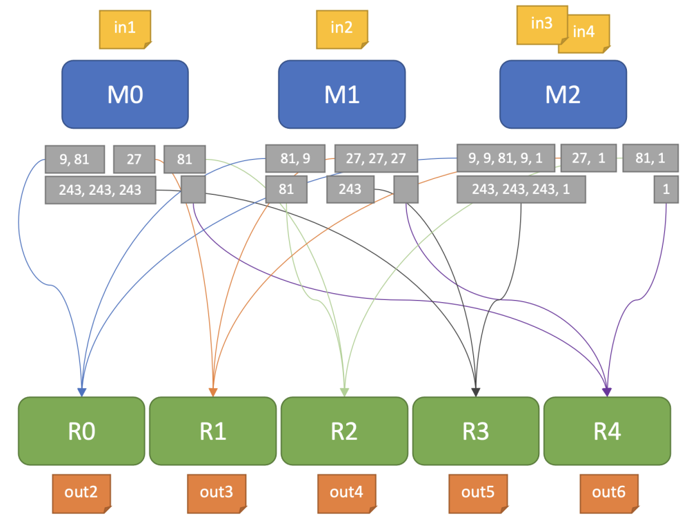

# Map Reduce C++
This is a parallel program in Pthreads for finding numbers greater than 0 that are perfect powers from a set of files and counting the unique values for each exponent. 

The input files will be divided (dynamically) as evenly as possible to some threads that will parse them and check which numbers greater than 0 are perfect powers (the Map operation), thus resulting in partial lists for each exponent (ex ., lists for perfect squares, lists for perfect cubes, etc.). The next step is the combination of the partial lists (the Reduce operation) after which aggregate lists will be obtained for each individual exponent. For each such list, the unique values will be counted in parallel, the results being then written in some output files.

## Technical details
Given a set of N documents, count the unique values greater than 0 of perfect power type for each exponent E using Map-Reduce. in the implementation of the theme, there will be threads that can be of two types, Mapper or Reducer
## Mapper
Starting from the list of documents to be processed that will be available in the input file, each Mapper will end up processing some documents. Each Mapper will perform the following actions, for each file it is responsible for:
- open the file and go through it line by line (on each line there is a numerical value of integer type)
- for each integer read, check if it is a perfect power of 2, 3, 4, etc. greater than 0 (the maximum exponent up to which it checks is given by the number of Reducer threads, as will be explained later)
- every value greater than 0 that is a perfect power with an exponent E is saved in a partial list

## Reducer
A Reducer thread of execution will be responsible for aggregating and counting perfect power values for a single exponent (for example, one Reducer will deal with perfect squares, another with perfect cubes, etc.). Thus, having the results from the Map operation, a Reducer will perform the following actions:
- combine the partial lists for the exponent E it is responsible for into an aggregate list (combination step)
- counts the unique values from the aggregated list and writes the result to a file (processing step).

## Execution
The program will run as follows:
```./tema1 <nr_mappers> <nr_reducers> <input_file> ```
The input file has the following format
```
number_of_files_to_process
file1 
file2
... 
fileN
```
A file to be processed has the following format:
```
nr_of_values_to_process 
value1 
... 
valueN
```
Depending on the number of Reducer threads, the maximum exponent **E** will be calculated up to which the perfect powers greater than 0 are checked. For example, if it is run with three Reducer threads, E will be 4 (squares are checked perfect numbers, perfect cubes, and numbers that are perfect powers with exponent 4). The program will have one output file for each Reducer, which will be called **outE.txt**, where E is the exponent for which each Reducer is responsible. An output file will contain a single value of type integer, that is, the number of unique values greater than 0 that are perfect powers of the exponent E.
## Example
```
$ cat test.txt 
4 
in1.txt 
in2.txt 
in3.txt 
in4.txt
```

```
$ cat in1.txt 
6 
243 
9 
27 
243 
81 
243 
$ cat in2.txt 
6 
81
9 
27 
243 
27 
27 
$ cat in3.txt 
6 
9 
27 
9 
81 
9 
53 
$ cat in4.txt 
5 
243 
243 
243 
1 
0
$ ./tema1 3 5 test.txt
```
```
M0 → in1.txt 
M1 → in2.txt 
M2 → in3.txt, in4.txt
```
```
M0 → {9, 81}, {27}, {81}, {243, 243, 243}, {}
M1 → {81, 9}, {27, 27, 27}, {81}, {243}, {}
M2 → {9, 9, 81, 9, 1}, {27, 1}, {81, 1}, {243, 243, 243, 1}, {1}
```
```
R0 → {9, 81, 81, 9, 9, 9, 81, 9, 1} 
R1 → {27, 27, 27, 27, 27, 1}
R2 → {81, 81, 81, 1}
R3 → {243, 243, 243, 243, 243, 243, 243, 1}
R4 → {1}
```
```
$ cat out2.txt 
3 
$ cat out3.txt 
2 
$ cat out4.txt 
2 
$ cat out5.txt 
2 
$ cat out6.txt 
1
```


